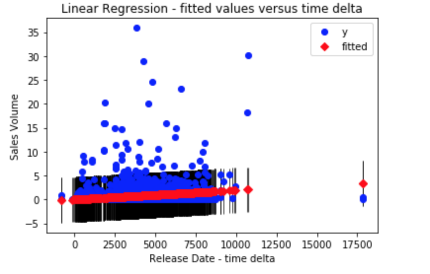

#### Minimum Viable Consulting

## Analysis of Video Games Industry

I used a linear regression model for predicting video game sales volume.
To predict the target value, I used the release date time delta as a feature.

Below we can see a plot with the fitted values in red, and the actual Y values in blue. The black lines represent confidence intervals.

The result of the regression indicates that the feature selected explains only 12% of the variance, and the feature alone may not be significant to the sales volume.
