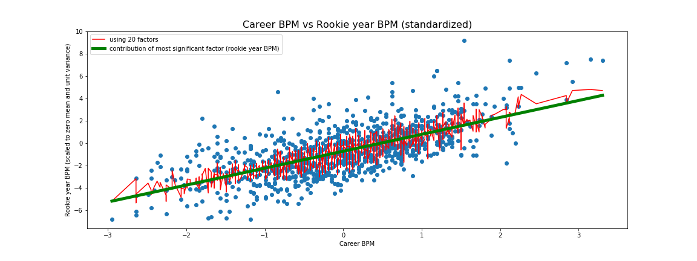

## Analysis of Box Plus/Minus (BPM) advanced statistic in Basketball

I used a linear regression model with LASSO regularization with 20 features to predict the career BPM statistic from rookie year data for a player.

The figure depicts the effect of the most significant factor, the rookie year BPM statistic, plotted in green over the data.  The target statistic is shown on the y-axis.  In red is the actual predictions of the full model using all 20 features.