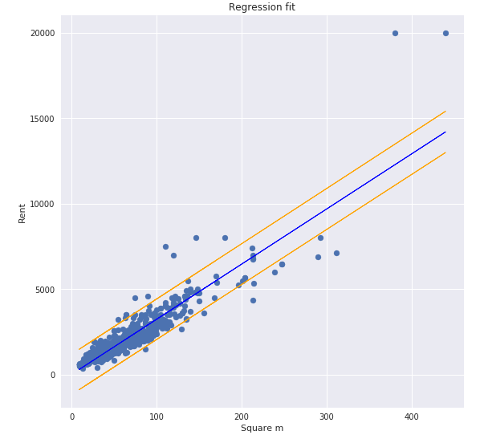
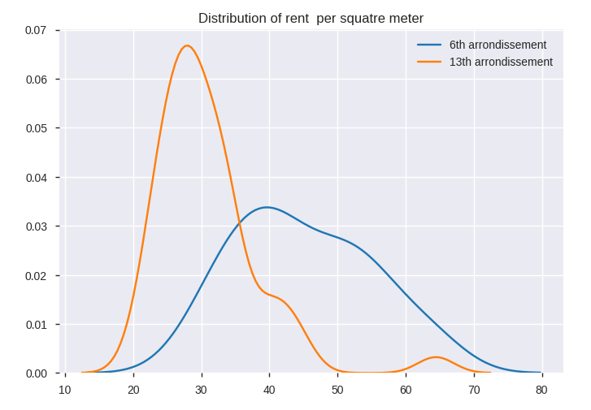
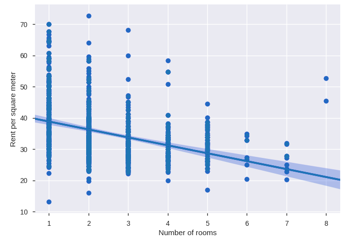

```markdown
#### Minimum Viable Consulting

## Predicting expected rents of real estate sales listings in Paris

Using a sample of rentals listings, I tried to explain the rent as a function of the square meter surface.  

The figure depicts the model (blue) plotted against the actual data points. The prediction interval is plotted in orange.  



This result suggests that the surface is a good predictor of the rent (R2=0.94), but the model tend to have an error of 2k €, which is huge!  

To go further, we can focus on the rent per square meter and see how it varies with other available variables.  

The price / m2's distribution seems to be significantly different from a district to another.  



The price / m2 tend to decrease when the number of rooms increases. However its variance seem to decrease when the number of rooms goes up.  



Hence, I will try to explain the price / m2 using features related to the flat or its location in order to increase the precision of the estimation.
```