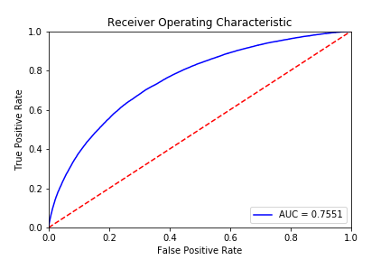
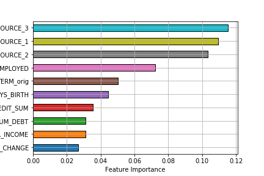

## Predicting Home Credit Default Risk

I used a Gradient Boosting model (XGBoost) to predict loans that are likely to default.  I achieved an ROC AUC of .755 through some feature engineering and hyperparameter tuning.

Through inspection, I've learned that the features with the most predictive power include 3 external sources provided in the original application data (most likely credit scores), employment length, and term of the loan.